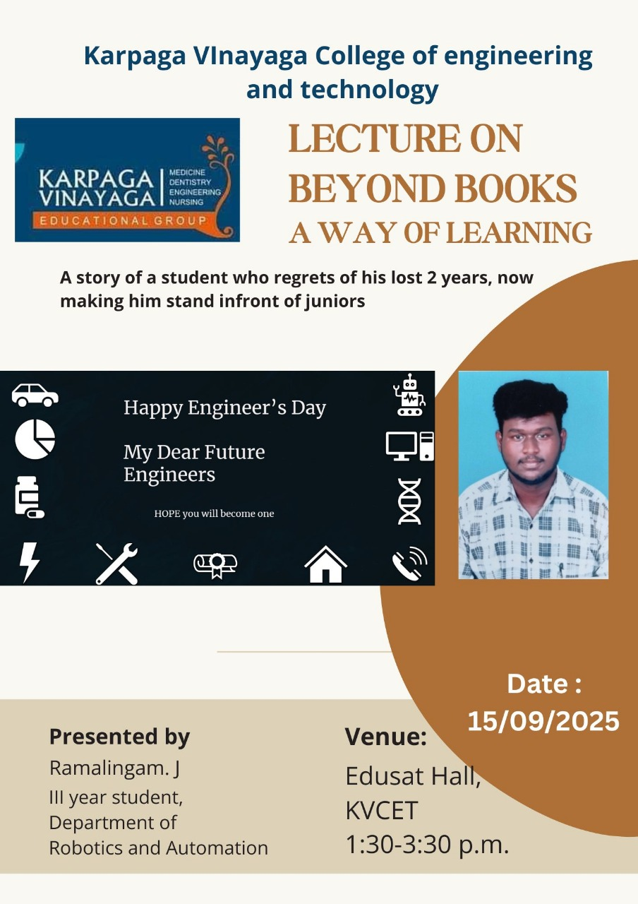
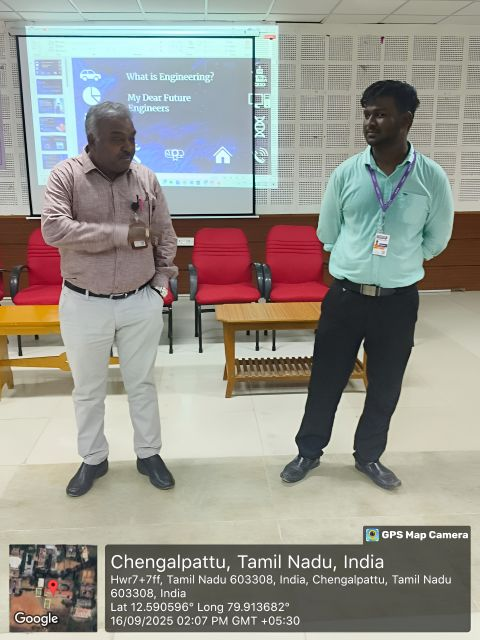
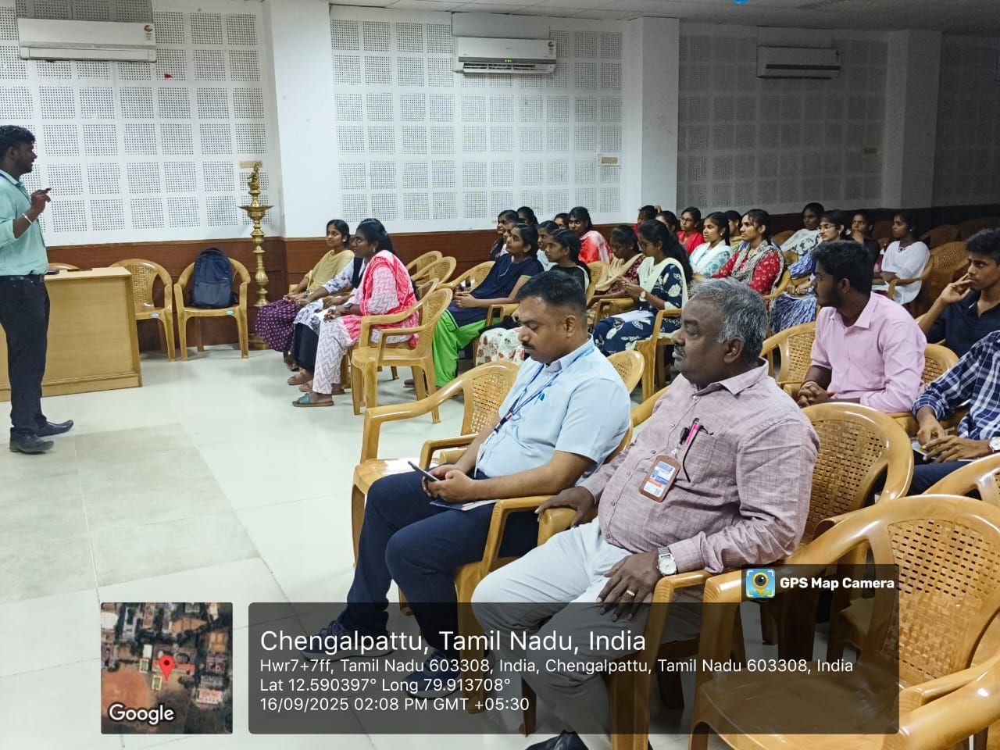
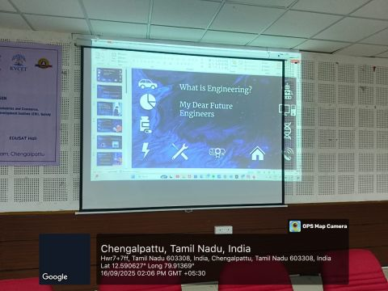
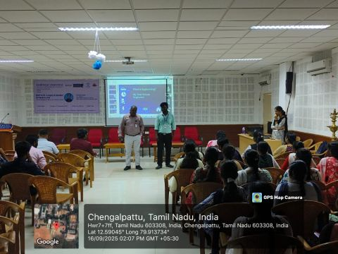

# Beyond Books: A Way of Learning

> *A technical awareness session encouraging first-year engineering students to build an engineering mindset beyond classroom learning.*

---

## Event Information

| Item | Details |
|------|---------|
| Event | Beyond Books: A Way of Learning |
| Date | 16 September 2025 |
| Time | 1:30 PM – 3:30 PM |
| Duration | 2 Hours |
| Venue | Edusat Hall, Karpaga Vinayaga College of Engineering and Technology |
| Audience | First-Year Engineering Students |
| Participants | Approximately 50 |
| Organized By | Cluster II Student Community |
| Speaker | Ramalingam J. |
| Role | Student Representative |

---

## Event Poster

The official poster used to announce the event.

---

## Overview

**Beyond Books: A Way of Learning** was a technical awareness session conducted for first-year engineering students to encourage them to look beyond examinations, grades, and degree completion.

The session introduced engineering as a discipline built on curiosity, problem solving, continuous learning, and practical application. Through personal experiences, career awareness, and carefully curated learning resources, students were encouraged to make informed decisions from the beginning of their engineering journey.

---

## Objectives

- Encourage students to develop an engineering mindset beyond academic performance.
- Introduce the difference between studying and learning.
- Create awareness about Minor and Honors Degree opportunities.
- Explain product-based and service-based career paths.
- Introduce trusted free learning platforms and certifications.
- Encourage self-driven learning and long-term skill development.

---

## Session Highlights

The session opened with two questions:

> **What is Engineering?**

> **Who is the real Engineer?**

These questions became the foundation for discussions throughout the session.

Topics covered included:

- Engineering beyond academic examinations.
- Studying versus learning.
- Problem solving as the foundation of engineering.
- Minor and Honors Degree opportunities.
- Product-based and service-based career paths.
- Programming language choices based on goals.
- Skill development and certifications.
- The **Learning at No Cost** initiative.
- Building projects throughout college.
- Investing in productivity rather than unnecessary expenses.

Students were also introduced to several trusted learning platforms, including:

- Coursera
- Infosys Springboard
- HP LIFE
- Saylor Academy
- IBM SkillsBuild
- Google Learning Resources
- freeCodeCamp

- A QR code was shared at the end of the session, providing students with a curated document containing free learning platforms, certifications, and additional resources for continued self-learning.

---

## Presentation

The session was delivered using a presentation prepared specifically for this event.

The presentation is available in the `presentation/` directory.

Refer to `presentation/README.md` for an overview of its contents.

---

## Engineering Perspective

One of the primary goals of this session was to challenge a few commonly accepted assumptions about engineering education.

> **Just because a person holds an engineering degree certificate does not automatically make them an engineer.**

> **Engineering is demonstrated through curiosity, problem solving, communication, and the ability to apply knowledge.**

A significant part of the discussion focused on distinguishing **studying** from **learning**.

- **Studying** helps students complete a curriculum and succeed academically.
- **Learning** develops the ability to understand, question, communicate, build, and solve meaningful problems.

The discussion also emphasized academic responsibility.

> **CGPA and arrears do not define a student's potential as an engineer. However, they can influence opportunities by acting as eligibility criteria during placements and higher studies.**

The intention was never to reject academics, but to encourage students to complement formal education with continuous learning and practical application.

---

## Gallery

### Associate Dean introducing the session

Associate Dean (Capacity Building) introducing the session and the speaker to first-year engineering students.

---

### Discussing Engineering Beyond the Classroom

Introducing the question **"What is Engineering?"** and encouraging students to think beyond examinations and degree completion.

---

### Presentation in Progress

A discussion-driven session encouraging students to explore engineering beyond the prescribed curriculum.

---

### Session Overview

A front view of students and faculty members during the Beyond Books session.

---

## Outcome

The session encouraged first-year students to begin exploring engineering beyond the prescribed curriculum by introducing practical learning resources, academic opportunities, and engineering perspectives early in their college journey.

Many of the ideas introduced during this session later became recurring themes in subsequent Cluster II initiatives, particularly around engineering mindset, self-driven learning, and practical skill development.

---

## Acknowledgements

This student-led initiative was made possible through the encouragement and support of the college management and faculty members.

Special appreciation to:

- Dr. Karthigairajan M. — Cluster II Staff In-charge
- Dr. K. Thirunadana Sikamani — Associate Dean (Capacity Building)
- Dr. K. S. Balamurugan Sathiah — Head of Department, Electronics and Communication Engineering

Their encouragement and support played an important role in enabling this initiative.

---

## Event Metadata

| Item | Details |
|------|---------|
| Event Type | Technical Awareness Session |
| Format | Offline |
| Organizer | Cluster II Student Community |
| Speaker | Ramalingam J. |
| Documentation Version | 1.0 |

---

## Additional Resources

See `external-links.md` for:

- Public LinkedIn post documenting the event.
- Presentation references.
- Learning resources introduced during the session.