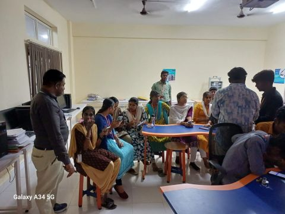

# Workshop on Learning at No Cost

> *A hands-on workshop enabling students to begin their learning journey through trusted platforms, financial aid opportunities, and practical guidance.*

---

## Event Information

| Item | Details |
|------|---------|
| Event | Workshop on Learning at No Cost |
| Theme | RoadMap for Learning at No Cost – From Coursera to GitHub |
| Date | 25 September 2025 |
| Time | 1:30 PM – 3:30 PM |
| Duration | 2 Hours |
| Venue | IoT & Robotics Laboratory, Karpaga Vinayaga College of Engineering and Technology |
| Audience | Engineering Students |
| Organized By | Cluster II Student Community |
| Speaker | Ramalingam J. |
| Role | Student Representative |

---

## Overview

The **Workshop on Learning at No Cost** was conducted as a practical, hands-on learning session to help students discover high-quality educational opportunities without financial barriers.

Unlike a conventional seminar, the workshop focused on live demonstrations, individual guidance, and enabling students to begin learning immediately. Students were introduced to trusted learning platforms, financial aid opportunities, AI-assisted learning, and strategies for becoming self-driven learners.

---

## Objectives

- Introduce students to trusted free learning platforms.
- Demonstrate how to obtain professional certifications through financial aid and institutional collaborations.
- Encourage self-driven learning beyond the classroom.
- Introduce practical AI prompting techniques.
- Guide students in starting their learning journey during the workshop itself.

---

## Session Highlights

The workshop included practical demonstrations on:

- Accessing Coursera professional certificates through Infosys Springboard.
- Applying for Coursera Financial Aid.
- Writing effective Financial Aid responses.
- Understanding AI prompting and practical use cases.
- Linking learning accounts and starting certification courses.
- Introducing GitHub and continuous learning resources.

Students were encouraged to complete the initial setup during the session, allowing them to leave with a clear path to continue learning independently.

---

## Workshop Resources

A QR code was shared during the session, providing students with curated learning resources, certification platforms, and reference materials discussed throughout the workshop.

Workshop resources are available in the `resources/` directory.

---

## Gallery

### Demonstrating Coursera Financial Aid

A live demonstration explaining how students can apply for Coursera Financial Aid, access professional certifications, and begin learning without financial barriers.

---

### Faculty Visit During the Workshop

Head of the Department of Electronics and Communication Engineering visiting the workshop while students actively participated in the hands-on session.

---

## Outcome

Students completed the workshop with practical knowledge of accessing learning platforms, applying for financial aid, and beginning professional certification courses. Rather than only introducing resources, the workshop enabled participants to take immediate action toward continuous learning.

The session reinforced the idea that meaningful learning requires investment in **time, effort, and curiosity—not necessarily money.**

---

## Acknowledgements

This student-led workshop was made possible through the encouragement and support of the college management and faculty members.

Special appreciation to:

- Dr. K. Thirunadana Sikamani — Associate Dean (Capacity Building)
- Dr. Karthigairajan M. — Cluster II Staff In-charge
- Dr. K. S. Balamurugan Sathiah — Head of Department, Electronics and Communication Engineering
- Dr. Saravanan D. — Head of Science and Humanities
- Dr. Srinivas Jayaraman — Head of Department, Robotics and Automation

Their encouragement and support helped make this initiative possible.

---

## Event Metadata

| Item | Details |
|------|---------|
| Event Type | Hands-on Workshop |
| Format | Offline |
| Organizer | Cluster II Student Community |
| Speaker | Ramalingam J. |
| Documentation Version | 1.0 |

---

## Additional Resources

See `EXTERNAL_LINKS.md` for the public LinkedIn post, workshop references, and additional learning resources.